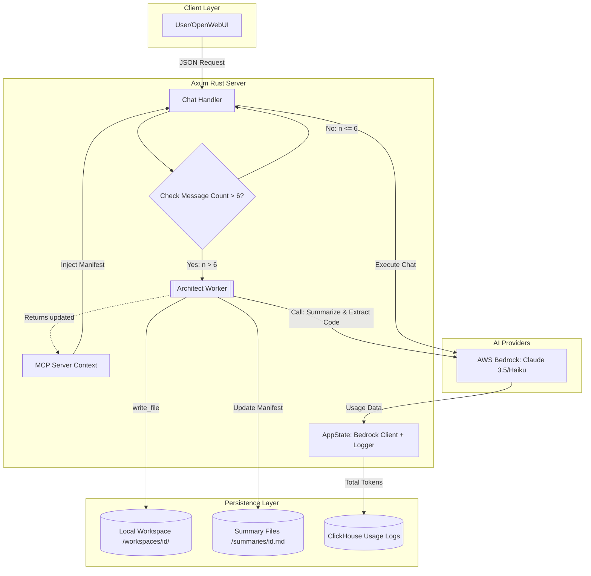

To transform your Axum proxy into a **Context-Compressed, Disk-Aware MCP Server**, we need to orchestrate several distinct "Jobs." Below is the logical breakdown followed by the Mermaid architecture.

### 📋 The Job List

1.  **Request Interception & State Check**: 
    * Monitor the `messages` array length. 
    * If `len > 6`, trigger the **Architect Worker**.
2.  **Architect Extraction (The "Compression" Job)**:
    * Identify the oldest $N-5$ messages.
    * Extract code blocks, rules, and technical decisions.
    * Summarize the "Intent" and "Task Progress" into a structured Manifest.
3.  **Disk-Aware Sync (The "MCP" Job)**:
    * Take the extracted code blocks and use the `write_file` MCP tool to save them to `./workspaces/{id}/`.
    * Update the File Map in the Manifest to point to these physical files.
4.  **Context Injection**:
    * Replace the dropped messages with the **State Manifest** (Markdown).
    * Inform the LLM that it has an active **MCP File System Tool** available for this workspace.
5.  **Unified Token Accounting**:
    * Calculate: $Tokens_{Architect} + Tokens_{Main\_Chat} + Tokens_{MCP\_Overhead}$.
    * Send the aggregated usage to the **ClickHouseLogger**.

---

### 🏗️ Architecture: MCP Disk-Aware Proxy

This diagram illustrates how the request flows through your Axum handler, triggers the Architect for compression, and interacts with the local filesystem via MCP.

### Key Architectural Shifts:
* **Decoupled Intelligence**: The **Architect** uses a fast model (Haiku) to manage the disk, while the **Main Handler** uses a smart model (Sonnet/Opus) for the actual conversation.
* **The Manifest as a Bootloader**: The `.md` file in `/summaries/` acts as the "system image" that re-syncs the LLM's brain every time you clear the history.
* **MCP as the Interface**: Instead of the LLM "guessing" what's in the files, it uses standard MCP `list_directory` or `read_file` tools to pull only the code it actually needs to see for the current user prompt.

**Would you like me to write the Rust code for the `Architect Worker` that handles the extraction and file-writing logic?**